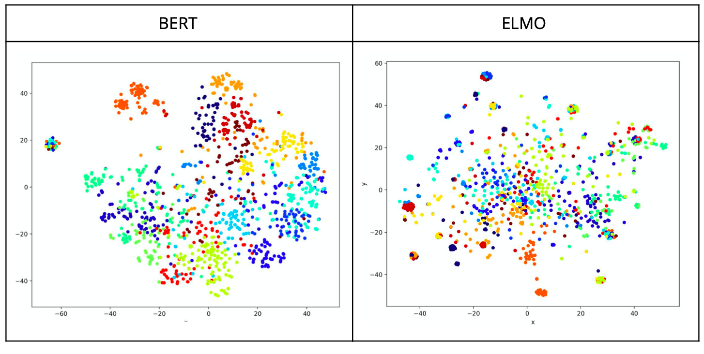
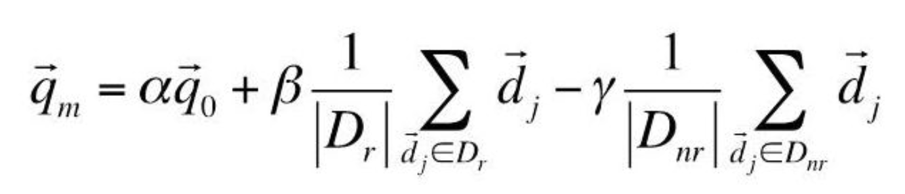
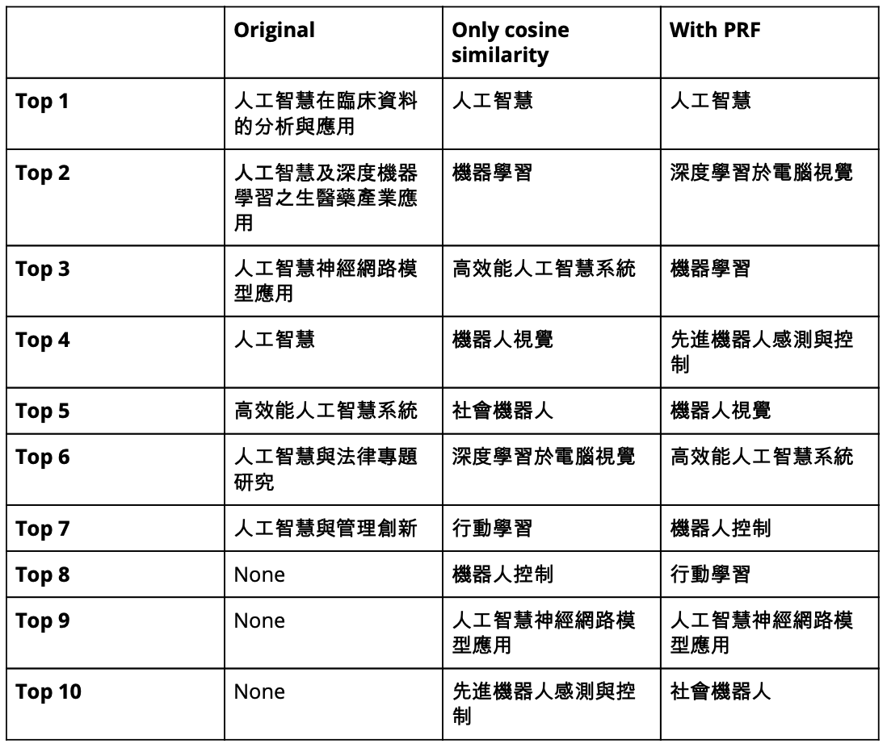

# PRF-BERT NTU Course Query System

## Background
The original NTU course system searches courses by string matching with query. In that way, students cannot get the truly "related" courses they want but they only get the courses which have the same characters. Therefore, we decide to implement a new search engine by integrating what we learn in DSP.

## Implementation
### 1. Embed course name (BERT/ELMO)

Firstly, we embed course names by language model. 

We perform experiments to determine which model should we use. We cluster the course by their embedding code, and the dots with the same color are from the same department. We can observe that BERT perform better than ELMO.

### 2. Perform cos similarity with query

Perform cos similarity on course with query, and sort than from the largest to the smallest.

### 3. Optimize by PRF

1. Sort courses name by their cosine similarity with query.
2. Select the top K ones and suppose they are related to our query. On the other hand, the bottom K ones are irrelevant.
3. Perform relevance feedback. We use Rocchio Algorithm.
    

## Result
`query = "人工智慧"`

    

In our method, if we search AI (人工智慧), we can get result including ML (機器學習), social robot (社會機器人), and AI. To be more specific, we will not only find courses which have string matching with the query but also find course which are really related to our query.

## Author

- [ByronHsu](https://github.com/ByronHsu)
- [JoeyYang](https://github.com/joeyy5588)
